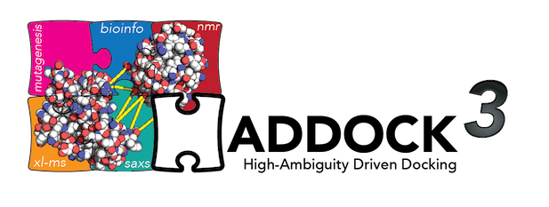
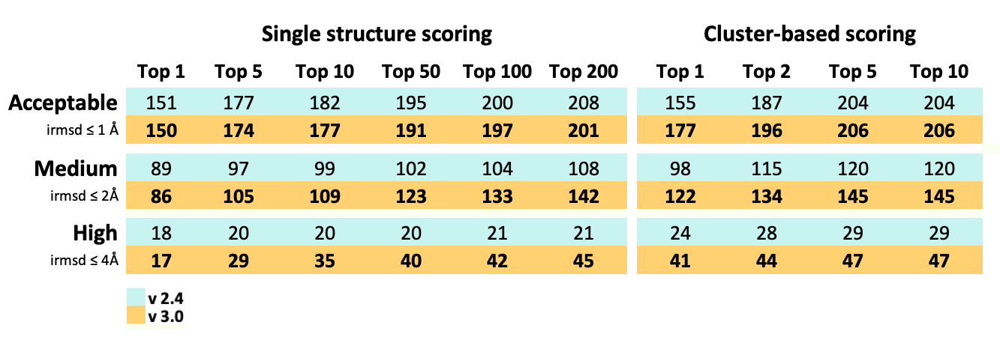

[](https://github.com/haddocking/haddock3/releases)
[](http://alembick.science.uu.nl:8080/job/haddock3/job/master/)
[](https://codecov.io/gh/haddocking/haddock3)
[](https://github.com/haddocking/haddock3/blob/master/LICENSE)




**ATTENTION: This repository is under heavy development and will change abruptly and without warning.**

## Registration

Please consider registering for haddock3. Visit for this: [https://www.bonvinlab.org/software/haddock3](https://www.bonvinlab.org/software/haddock3)

## Installation

Please refer to [INSTALLATION.md](INSTALLATION.md)

## Description

HADDOCK v3.0 is a bottom-up reimagination of the long standing time-proven [HADDOCK](http://www.bonvinlab.org/software) used for integrative modeling of biomolecular complexes.
This young and still very-experimental (use it at your own risk!) aims to modularize and extend HADDOCK's core functions.

In its current implementation (Alpha2) HADDOCK v3.0 still lacks the full repertoire of features present at the production version, [HADDOCK v2.4](https://wenmr.science.uu.nl/haddock2.4/).
However it is able to take full advantage of the ambiguous interaction restraints (AIRs) to drive the docking process.

It was evaluated using the [Protein-Protein Docking Benchmark 5](https://github.com/haddocking/BM5-clean) and compared with the live version (v2.4).
This evaluation was done using the true interface of each complex of (4.9 Å) and is expressed in terms of success rate; the amount of BM5 targets that have at least one docking solution below the specified threshold within a specified subset of solutions ranked by HADDOCK-score.




## Technical details
HADDOCK v3.0 main input file is a [.toml](https://github.com/toml-lang/toml) containing the parameters that will be used in the simulation.

```toml
#===========================================================#
title = "HADDOCK3 Example setup file"
#===========================================================#
[molecules]
mol1 = '1AY7_r_u.pdb'
mol1.segid = "A"
mol2 = '1AY7_l_u.pdb'
mol1.segid = "B"

[restraints]
ambig = 'ambig.tbl'

[identifier]
run = 1

[execution_parameters]
scheme = 'parallel'
nproc = 2

# Stage specific parameters
[stage]
[stage.topology]
recipe='default'

[stage.rigid_body]
recipe='default'
sampling = 1000
params.auto_his = true

[stage.semi_flexible]
recipe='default'
sampling = 200

[stage.water_refinement]
recipe='default'
sampling = 200
#===========================================================#
```

*The complete list of parameters will be available soon* 

In the [example](examples/protein-protein) the simulation will be executed in parallel and will use a minimal version of the rigid-body protocol with automatic histidine protonation, the default semi-flexible stage and also default water-refinement.

Upon execution the following folder structure will be created:

```
run1/
|_ data/
    |_ ambig.tbl
    |_ mol1_1.pdb
    |_ mol2_1.pdb
    |_ run.toml
|_ topology/
   |_template/generate-topology.cns
|_ rigid_body/
   |_template/it0.cns
|_ semi_flexible/
   |_template/it1.cns
|_ water_refinement/
   |_template/itw.cns
```

Here we define `one model = one task`, so during execution each `.inp`, `.out` and resulting files will be created 
inside its own folder:

```
run1/topology/
        |_ generate_0000001.inp
        |_ generate_0000001.out
        |_ generate_0000002.inp
        |_ generate_0000002.out
        |_ mol1_1.pdb
        |_ mol1_1.psf
        |_ mol2_1.pdb
        |_ mol2_1.psf
        |_ template/
            |_ generate_topology.cns
```


** Documentation is a work-in-progress, more to come.
