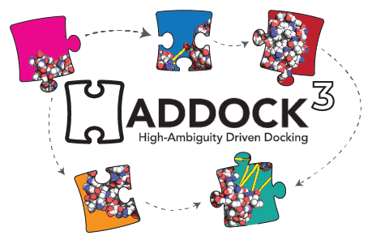

# `haddock3`

<!-- <p align="center">

  
</p>
<src > -->

[](https://doi.org/10.5281/zenodo.10527751)
[](https://research-software-directory.org/software/haddock3)
[](https://fair-software.eu)
[](https://www.bestpractices.dev/projects/8844)

[](https://github.com/haddocking/haddock3/actions?workflow=tests)
[](https://github.com/haddocking/haddock3/actions?workflow=build)
[](https://github.com/haddocking/haddock3/actions?workflow=pages)

[](https://app.codacy.com/gh/haddocking/haddock3/dashboard?utm_source=gh&utm_medium=referral&utm_content=&utm_campaign=Badge_grade)
[](https://app.codacy.com/gh/haddocking/haddock3/dashboard?utm_source=gh&utm_medium=referral&utm_content=&utm_campaign=Badge_coverage)


## Introduction

HADDOCK stands for **H**igh **A**mbiguity **D**riven protein-protein **DOCK**ing, it is a widely used computational tool for modeling protein-protein interactions. Developed by researchers at [Utrecht University](https://uu.nl) in the [BonvinLab](https://bonvinlab.org) it integrates various types of experimental data to guide the docking process, including biochemical, biophysical, and bioinformatics information.

## Installation

Please check the [INSTALL](docs/INSTALL.md) file for instructions.

You might also want to check the following utilities:

- [`haddock-restraints`](https://github.com/haddocking/haddock-restraints): Tool to generate restraints to be used in `haddock3`.
- [`haddock-runner`](https://github.com/haddocking/haddock-runner): Tool to run large scale `haddock3` simulations using multiple input molecules in different scenarios
- [`haddock-tools`](https://github.com/haddocking/haddock-tools): Set of useful utility scripts developed over the years by the BonvinLab group members

## Usage

The most basic usage is;

```bash
haddock3 <configuration-file.toml>
```

Check the [EXAMPLES](examples/README.md) page for more some usage examples and the [MANUAL]() (_coming soon!_) for a more detailed explanation of the configuration file.

## Support

If you encounter any code-related issues, [please open an issue](https://github.com/haddocking/haddock3/issues/new/choose).

If you have any other questions or need help, please contact us at [ask.bioexcel.eu](https://ask.bioexcel.eu/).

If you clone this repository and use `haddock3` for your research, please support us by signing up in [this form](https://forms.gle/LCUHiYHh1hE9rd8L6). This will allow us contact you when needed for `haddock3`-related issues, and also provide us a mean to demonstrate impact when reporting for grants - which grealty helps us to keep the project alive!

## Development

🚧 _Coming soon! We are currently working on the development guide_ 🚧

### Code Documentation

The code documentation is automatically built and hosted at [bonvinlab.org/haddock3](https://www.bonvinlab.org/haddock3/).

To build it locally (considering you have followed the installation instructions):

```bash
tox -e docs
```

> Warning messages are expected, but the documentation should be built successfully.

The rendered documentation will be available at `haddock3-docs/index.html`. This will open a local webpage with the

### Contributing

Check the [CONTRIBUTING](CONTRIBUTING.md) file for instructions on how to contribute with the project!

<!-- ---

Happy HADDOCking!

 -->
