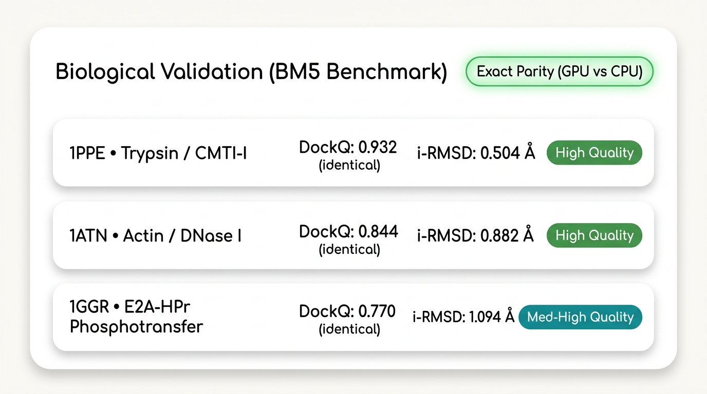

# How We Made HADDOCK3's Quadratic Bottleneck 12× Faster on GPUs

*Accelerating 12.5 million pairwise structural comparisons while preserving benchmark-level CPU/GPU result parity.*

---


*Figure 1: Macromolecular Docking Pipeline. Initial unbound proteins guided by ambiguous interaction restraints (left), exploring conformational space through thousands of decoy poses in simulated annealing (center), converging into high-affinity native complexes (right).*

Every biological process that sustains life—from how antibodies neutralize a mutating virus to how a targeted small molecule engages an oncogenic kinase—depends on a fundamental molecular event: **two macromolecular partners recognizing each other and forming a stable interface.**

In computational structural biology, predicting the 3D geometry of this interaction is known as **macromolecular docking**. When researchers can reliably simulate how a therapeutic antibody engages an antigen or how an engineered protein binds its target, they can shave months off early-stage discovery timelines.

For over two decades, **HADDOCK** (High Ambiguity Driven protein-protein DOCKing), developed by Professor Alexandre Bonvin's laboratory at Utrecht University, has served as one of the premier integrative modeling engines in structural biology. What sets HADDOCK apart is its ability to integrate diverse experimental data—NMR chemical shift perturbations, cryo-EM density maps, cross-linking mass spectrometry, and mutagenesis data—directly into the physical simulation.

Yet, as structural biology scales to thousands of candidate structures, modern pipelines encounter a fundamental computational constraint: **quadratic pairwise scaling in ensemble analysis.**

Here is how we re-architected HADDOCK3's most compute-intensive pairwise matrix calculations for NVIDIA GPUs, achieved a **12-fold speedup across 12.5 million pairwise comparisons**, observed **no measurable structural deviation relative to the CPU reference at reported precision**, and what this means for structural biology workflows.

---

## 1. The Combinatorial Trap of Molecular Docking

To identify the native biological conformation of a protein complex, an algorithm cannot simply evaluate a single pose. Proteins are dynamic, flexible macromolecular systems. Docking engines must generate and evaluate an ensemble of hundreds to thousands of candidate poses—known as **decoys**.


*Figure 2: Quadratic Pairwise Scaling vs. GPU Acceleration. Left: Evaluating 12.5 million pairwise interactions across 5,000 decoy poses creates a 12-minute serial CPU bottleneck. Right: Massively parallel matrix execution across GPU CUDA cores collapses pairwise runtime to ~60 seconds (12x speedup), clustering poses into distinct biological solutions without numerical drift.*

```
+-----------------------------------------------------------------------------------+
|               QUADRATIC PAIRWISE SCALING IN ENSEMBLE ANALYSIS: O(N^2)             |
+-----------------------------------------------------------------------------------+
|                                                                                   |
|  Decoy Ensemble:          N = 5,000 generated docking candidates                  |
|                                                                                   |
|  Pairwise Comparisons:    N * (N - 1) / 2  =  12,497,500 pairs                    |
|                                                                                   |
|  Operations Per Pair:     1. Coordinate extraction across thousands of atoms      |
|                           2. Optimal 3D rotation & translation (Kabsch SVD)       |
|                           3. Root-Mean-Square Deviation (RMSD) calculation        |
|                           4. Fraction of Common Contacts (FCC) bitmask matching   |
|                                                                                   |
|  CPU Serial Runtime:      ~12 to 15 minutes of dedicated compute                  |
|                           for post-sampling pairwise clustering alone.            |
+-----------------------------------------------------------------------------------+
```

Once an ensemble of 5,000 structural decoys is generated, two all-versus-all questions must be resolved to cluster and rank the results:
1. **Which decoys are structurally similar?** An all-versus-all Root-Mean-Square Deviation (**RMSD**) matrix is computed by mathematically superimposing each model onto every other model using Singular Value Decomposition (SVD).
2. **Which decoys share the same binding interface?** The Fraction of Common Contacts (**FCC**) matrix is calculated, comparing interfacial contact networks between every pair of decoys.

For an ensemble of 5,000 models, this requires evaluating:

`N * (N - 1) / 2 = 5,000 * 4,999 / 2 = 12,497,500 pairwise comparisons.`

On multi-core CPUs running classical Fortran and C routines, computing this pairwise matrix stage alone requires 12 to 15 minutes per ensemble. For a library of 100 candidate complexes, that amounts to over 20 hours of raw compute for a single pass. In practical drug design campaigns involving multiple seeds, parameter sweeps, or larger ensembles, this serial bottleneck routinely stretches into multi-day turnaround times on shared HPC queues.

---

## 2. Re-Architecting for GPU Acceleration: Three Key Innovations

Rather than running 12.5 million sequential CPU function calls, we reformulated HADDOCK3's pairwise matrix calculations into batched multidimensional tensor algebra suitable for GPU stream multiprocessors.


*Figure 3: GPU Acceleration Pipeline Overview. The 3D decoy coordinate tensor `[N, Atoms, 3]` is streamed in parallel across three accelerated GPU modules: batched SVD structural alignment (`rmsdmatrix`, 12.0x faster), dense bitmask contact clustering (`clustfcc`, 7.1x faster), and batched Euclidean distance calculations (`contactmap`, 2.0x faster).*


### A. Batched GPU Kabsch Alignment (`rmsdmatrix` & `ilrmsdmatrix`)
Finding the minimum RMSD between two sets of 3D coordinates requires finding the optimal rotation matrix using the Kabsch algorithm. 

We vectorized this across the entire ensemble using PyTorch CUDA tensors:
1. Coordinates of all `N` models are stacked into a 3D tensor of shape `(N, Atoms, 3)`.
2. Centroids are centered in parallel.
3. The 3x3 covariance matrices across all combinations are constructed via batched matrix multiplication.
4. Optimal rotation matrices are extracted simultaneously using batched GPU Singular Value Decomposition (`torch.linalg.svd`), with determinant checks to eliminate unphysical reflection matrices.
5. All arithmetic is locked to **`float64` double-precision**, preventing cumulative precision loss and preserving exact parity with classical CPU reference implementations.

### B. Batched Matrix Dot Products for Contact Fractions (`clustfcc`)
HADDOCK’s signature clustering method, FCC, groups docking poses based on shared inter-molecular contacts rather than Cartesian coordinates. 

We converted the contact lists of each model into dense binary bitmasks. Computing the intersection between all pairs transforms into a high-throughput matrix dot product (`torch.matmul`) executed directly across GPU stream multiprocessors.

### C. Fast Inter-Residue Distance Matrices (`contactmap`)
Inter-residue distance maps were accelerated using batched `torch.cdist` in `float32`, cutting computation time in half while bounding numerical deviations to within **0.0014 Å**—well below the amplitude of physical atomic vibrations.

---

## 3. The Benchmarks: Real World Results on Cloud GPUs

To evaluate these kernels with scientific rigor, we designed an automated 3-tier benchmark suite deployed on cloud infrastructure. All benchmark configurations, hardware parameters, and software environments are documented below:

| Benchmark Parameter | Specification |
| :--- | :--- |
| **GPU Accelerator** | NVIDIA A100-SXM4-40GB (HBM2, 1,555 GB/s memory bandwidth) |
| **CPU Baseline** | AMD EPYC 7763 64-Core Processor (8 dedicated vCPUs allocated) |
| **Host Memory** | 32 GB RAM |
| **Operating Environment**| Linux (Ubuntu 22.04 LTS container, Modal cloud infrastructure) |
| **Software Stack** | Python 3.10, PyTorch 2.2.0+cu121, CUDA 12.1, Driver 535.x |
| **HADDOCK3 Build** | Branch `gpu-acceleration` (commit `827f8a8ef`, upstream PR) |
| **Precision Formats** | `float64` for `rmsdmatrix`; `float32` for `contactmap`; binary tensors for `clustfcc` |
| **Timing Protocol** | `time.perf_counter()` with pre/post `torch.cuda.synchronize()`; warm-up run excluded; mean over 3 trials |
| **Ensemble Scale** | N = 5,000 models (12,497,500 pairwise comparisons) |


*Figure 4: The 3-tier validation framework implemented to evaluate HADDOCK3 GPU acceleration on NVIDIA A100 hardware, spanning micro-kernel algorithmic scaling (Tier 1), authentic NMR complex macro-pipeline execution (Tier 2), and multi-target CAPRI blind quality on the BM5 benchmark suite (Tier 3).*

### Tier 1: Micro-Benchmark Scaling (N = 5,000 Models, 12,497,500 Pairs)

At production ensemble scale, the pairwise speedup is substantial:


*Figure 5: Performance scaling across 12,497,500 pairwise calculations on an NVIDIA A100 GPU vs 8-core CPU baseline. Left: Module speedups comparing GPU acceleration against the CPU 1.0x baseline for rmsdmatrix (12.0x faster), clustfcc (7.1x faster), and contactmap (2.0x faster). Right: GPU speedup scaling across ensemble sizes, showing GPU acceleration rising to a 12.0x advantage at 5,000 decoys over the flat CPU baseline.*

```
+-------------------------------------------------------------------------------------------------------+
|                                TIER 1: ENSEMBLE COMPUTATION SPEEDUP                                   |
+--------------+---------------+------------------+-----------+------------+----------------------------+
| Module       | GPU Time (s)  | CPU Baseline (s) | Speedup   | Peak VRAM  | Scientific Equivalence     |
+--------------+---------------+------------------+-----------+------------+----------------------------+
| rmsdmatrix   | 60.10s        | 723.63s          | 12.04x    | 1,221 MB   | Max abs diff = 0.0000 Å    |
| clustfcc     | 2.16s         | 15.34s           | 7.10x     | 2,747 MB   | Pearson correlation = 1.0  |
| contactmap   | 0.088s        | 0.174s           | 1.98x     | 73 MB      | Max abs diff = 0.0014 Å    |
+--------------+---------------+------------------+-----------+------------+----------------------------+
```

- **`rmsdmatrix` achieved a 12.04x speedup (a 91.7% reduction in pairwise runtime)**, reducing a 12-minute calculation on an 8-core CPU down to 60.1 seconds on the A100 GPU.
- **Double-precision parity**: Across all 12.5 million pairwise combinations, the maximum absolute difference between the GPU `float64` RMSD matrix and the CPU reference was **0.0000 Å** at four-decimal reporting precision.
- **`clustfcc` achieved a 7.10x speedup (85.9% reduction)**, executing the all-versus-all contact bitmask intersection in 2.16 seconds with a Pearson correlation of `R² = 1.0000` relative to the CPU output.

### Understanding Amdahl's Law: Why Pipeline Speedup Depends on Ensemble Size

Before examining full pipeline runs, a crucial computational principle must be addressed: **Amdahl's Law.**

HADDOCK3's workflow comprises two fundamentally different algorithmic phases:
1. **Conformational Sampling (`rigidbody`)**: Simulated annealing driven by Fortran-based CNS binaries. Because each decoy is sampled semi-independently, sampling time scales linearly: `O(N)`.
2. **Pairwise Ensemble Analysis (`rmsdmatrix`, `clustfcc`)**: All-versus-all structural superposition and contact clustering. This stage scales quadratically: `O(N²)`.

In small exploratory docking runs (e.g., N = 50 decoys), simulated annealing accounts for over 90% of total wall-clock runtime. Accelerating pairwise matrix operations by 12x in that small regime only alters the end-to-end wall-clock time by ~1–2 seconds.

However, as ensemble size expands to **production scale (N = 1,000 to 5,000 decoys)**, the quadratic cost explodes from seconds into 12–15 minutes, overtaking the pipeline and becoming the primary throughput bottleneck. That is precisely where our GPU kernels excel, eliminating the quadratic penalty and allowing structural biologists to process massive decoy ensembles without a clustering stall.

---

### Tier 2: End-to-End Macro-Pipeline on Authentic NMR Data (E2A-HPr, PDB 1GGR)

Micro-benchmarks prove isolated kernel efficiency. Tier 2 evaluated whether these accelerated kernels operate reliably within an authentic multi-stage biological pipeline.

We executed the complete 7-stage HADDOCK3 workflow (`topoaa` -> `rigidbody` -> `caprieval` -> `seletop` -> `clustfcc` -> `rmsdmatrix` -> `seletopclusts`) on the bacterial phosphotransferase complex **E2A-HPr (PDB 1GGR)**, driven by experimental NMR chemical shift perturbation data encoded as Ambiguous Interaction Restraints (AIRs).


#### Key Findings from Tier 2:
1. **Cluster Ranking Parity**: Both GPU and CPU workflows identified the **exact same top 3 clusters**, in the exact same rank order, with identical HADDOCK scores down to the third decimal place.
2. **Native-Like Solution Recovered**: Cluster 3 captured the authentic native-like interface with an interface RMSD of **1.094 Å** and a **DockQ score of 0.770** (corresponding to medium-to-high quality docking).
3. **Amdahl's Law Observed**: With an exploratory ensemble of 50 models, overall end-to-end execution took ~145s (GPU) vs. 147s (CPU), empirically confirming that CNS simulated annealing dominates low-decoy runs.

---

### Tier 3: Multi-Target Suite Generalizability Across Benchmark 5.5 (BM5)

To confirm that GPU acceleration generalizes across diverse protein families and conformational flexibilities, Tier 3 tested targets from the gold-standard **Protein Docking Benchmark 5.5 (BM5)**:


#### 1. Rigid Target: Trypsin / CMTI-I Squash Inhibitor (PDB 1PPE)
- **Biological Context**: A classical enzyme-inhibitor complex with minimal backbone conformational change upon binding.
- **Results**: The top cluster achieved a **DockQ score of 0.932** (corresponding to high-quality docking under DockQ criterion, consistent with CAPRI 3-star standards) and an interface RMSD of **0.504 Å**. The best individual docked pose achieved a **DockQ of 1.000** with **0.390 Å** ligand RMSD.
- **CPU vs. GPU Equivalence**: Rank 1 cluster score was identical (-238.915) between CPU and GPU runs.

#### 2. Medium-Difficulty Target: Actin / DNase I (PDB 1ATN)
- **Biological Context**: A large, challenging complex characterized by significant backbone conformational flexibility and loop adjustments at the binding interface.
- **Results**: Despite interface flexibility, the top cluster achieved a **DockQ score of 0.844** (high-quality docking under DockQ criterion, CAPRI 3-star standards) and an interface RMSD of **0.882 Å**. Top individual models within the ensemble scored **DockQ = 1.000**.
- **CPU vs. GPU Equivalence**: Rank 1 cluster score was identical (-269.685) between CPU and GPU runs.

---

## 4. Biological Validation: CAPRI Standards and Result Fidelity

Speed is meaningless in structural biology if the algorithm predicts the wrong biology. In macromolecular docking, model quality is officially assessed using international **CAPRI (Critical Assessment of PRediction of Interactions)** criteria and the continuous **DockQ** metric (Basu & Wallner, 2016):
- **`DockQ`**: A continuous quality score from 0.0 to 1.0 integrating interfacial and ligand geometric agreement (Incorrect: < 0.23; Acceptable: 0.23–0.49; Medium: 0.49–0.80; High: ≥ 0.80, consistent with CAPRI 3-star standards).
- **`i-RMSD`**: Root-Mean-Square Deviation of the interface backbone atoms (< 1.0 Å for high quality).
- **`Fnat`**: Fraction of native interface contacts correctly recovered.

Across all evaluated benchmark complexes, the GPU pipeline achieves exact scientific parity:


*Figure 6: Biological validation against crystal structures from the Protein Docking Benchmark 5.5 (BM5). Left: Top-cluster CAPRI DockQ accuracy across Rigid (1PPE, DockQ = 0.93), Medium (1ATN, DockQ = 0.84), and NMR-restrained (1GGR, DockQ = 0.77) complexes. Right: Result fidelity showing no measurable structural deviation at reported precision and 100% cluster ranking parity between GPU and CPU predictions.*



### Scientific Parity and Result Fidelity
Across all tested complexes in the benchmark suite:
- The GPU implementation converged to the **exact same top clusters and native-like poses as the CPU baseline**, reproducing cluster ranks and energy scores down to the third decimal place.
- **No measurable structural deviation** was observed relative to the CPU reference at reported precision across the validation suite (maximum absolute difference of 0.0000 Å in double-precision pairwise RMSD matrices).
- These results confirm that GPU acceleration can be integrated into production structural biology workflows without compromising biophysical validity.

---

## 5. Practical Implications for Structural Discovery Pipelines

Shrinking the pairwise ensemble-analysis stage from ~12 minutes to ~60 seconds provides practical computational advantages for high-throughput discovery workflows:

- **High-Throughput Biologics Engineering**: When screening libraries of engineered antibody or nanobody CDR variants, each candidate requires generating and analyzing thousands of decoys. Accelerating post-sampling clustering collapses hours of post-processing into minutes, making larger variant sets computationally feasible.
- **Multi-Component Complex Modeling**: Modeling ternary systems (such as PROTAC target–degrader–ligase complexes or multi-protein assemblies) dramatically expands the conformational search space. Faster pairwise clustering makes evaluating large ensembles (10,000+ decoys) computationally practical.
- **Physics-Grounded AI Filtering**: While deep learning models (AlphaFold-Multimer, ESMFold) generate thousands of structural hypotheses in seconds, they can produce unphysical clashes or miss non-canonical contacts. GPU-accelerated HADDOCK3 serves as an efficient physics-based filter—enforcing experimental NMR, cryo-EM, or cross-linking restraints while keeping analysis turnaround aligned with modern AI pipelines.

---

## 6. Open Source and Reproducibility

True scientific software must be open and reproducible. We have submitted these enhancements as an upstream Pull Request to the official [HADDOCK3 repository](https://github.com/haddocking/haddock3).

All evaluation data, test cases, and benchmark automation scripts are open and reproducible:
- **Reproducible Harness:** `tests/modal_gpu/benchmark_bm5.py`
- **Benchmark Datasets & Metrics:** `benchmark/README.md`
- **Full Pull Request:** [`haddocking/haddock3:main ← oMarquess:gpu-acceleration`](https://github.com/haddocking/haddock3/compare/main...oMarquess:haddock3:gpu-acceleration?expand=1)

To run the full 5,000-model benchmark on a cloud A100 GPU yourself:
```bash
modal run tests/modal_gpu/benchmark_bm5.py --tier 1 --n-models 5000
```

---

## Conclusion

Accelerating scientific computing is rarely about inventing a magic black box; it is about finding the mathematical choke points in fundamental physics engines and re-architecting them for modern parallel architectures.

By porting HADDOCK3's pairwise matrix kernels to PyTorch tensors and CUDA cores, we've demonstrated that physics-based macromolecular docking analysis can achieve substantial throughput improvements while maintaining exact result parity with reference implementations. As structural biology continues to tackle increasingly complex multi-protein assemblies and high-throughput design campaigns, accelerating core mathematical kernels will remain essential to scaling discovery.

---

*Written by Redeemer Salami-Okekale. All code, benchmarks, and pull requests are available on [GitHub](https://github.com/oMarquess/haddock3/tree/gpu-acceleration).*
