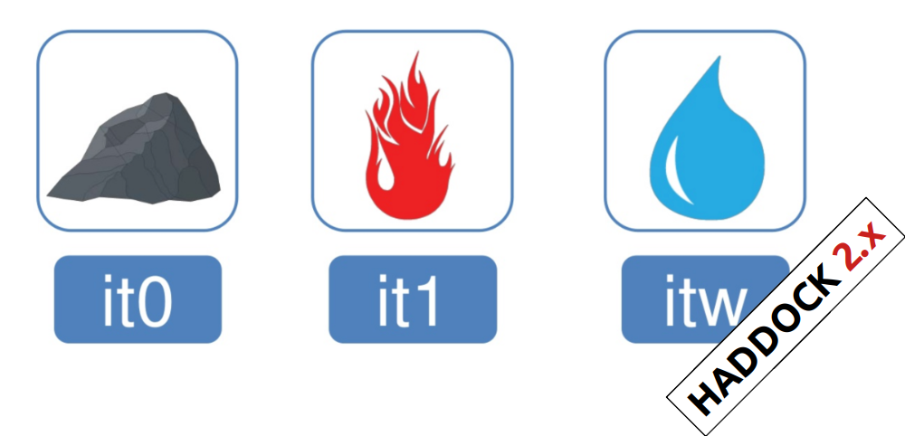

# A brief introduction to HADDOCK3

HADDOCK3 is the next generation integrative modelling software in the
long-lasting HADDOCK project. It represents a complete rethinking and rewriting
of the HADDOCK2.X series, implementing a new way to interact with HADDOCK and
offering new features to users who can now define custom workflows.

In the previous HADDOCK2.x versions, users had access to a highly
parameterisable yet rigid simulation pipeline composed of three steps:
`ridig-body docking (it0)`, `semi-flexible refinement (it1)`, and `final refinement (itw)`.



In HADDOCK3, users have the freedom to configure docking workflows into
functional pipelines by combining the different HADDOCK3 modules, thus
adapting the workflows to their projects. HADDOCK3 has therefore developed to
truthfully work like a puzzle of many pieces (simulation modules) that users can
combine freely. To this end, the “old” HADDOCK machinery has been modularised,
and several new modules added, including third-party software. As a
result, the modularisation achieved in HADDOCK3 allows users to duplicate steps
within one workflow (e.g., to repeat the `it1` stage of the HADDOCK2.x
rigid workflow).

Note that, for simplification purposes, at this time, not all functionalities of
HADDOCK2.x have been ported to HADDOCK3, which does not (yet) support NMR RDC,
PCS and diffusion anisotropy restraints, cryo-EM restraints and coarse-graining.
Any type of information that can be converted into ambiguous interaction
restraints can, however, be used in HADDOCK3, which also supports the
*ab initio* docking modes of HADDOCK.


To keep HADDOCK3's modules organised, we catalogued them into several
categories. But, there are no constraints on piping modules of different
categories.

The main module's categories are "topology", "sampling", "refinement",
"scoring", and "analysis". There is no limit to how many modules can belong to a
category. Modules are added as developed, and new categories will be created
if/when needed. You can access the HADDOCK3 documentation page for the list of
all categories and modules. Below is a summary of the available modules:

* **Topology modules**
    * `topoaa`: *generates the all-atom topologies for the CNS engine.*
* **Sampling modules**
    * `rigidbody`: *Rigid body energy minimisation with CNS (`it0` in haddock2.x).*
    * `lightdock`: *Third-party Glow-worm Swarm Optimisation (GSO) docking software.*
    * `gdock`: *Third-party genetic algorithm-based docking software.*
* **Model refinement modules**
    * `flexref`: *Semi-flexible refinement using a simulated annealing protocol through molecular dynamics simulations in torsion angle space (`it1` in haddock2.x).*
    * `emref`: *Refinement by energy minimisation (`itw` EM only in haddock2.4).*
    * `mdref`: *Refinement by a short molecular dynamics simulation in explicit solvent (`itw` in haddock2.X).*
* **Scoring modules**
    * `emscoring`: *scoring of a complex performing a short EM (builds the topology and all missing atoms).*
    * `mdscoring`: *scoring of a complex performing a short MD in explicit solvent + EM (builds the topology and all missing atoms).*
* **Analysis modules**
    * `alascan`: *Performs alanine scanning on the models generated in the previous step.*
    * `caprieval`: *Calculates CAPRI metrics (i-RMDS, l-RMSD, Fnat, DockQ) with respect to the top scoring model or reference structure if provided.*
    * `contactmap`: *Calculates the contact maps for the models generated in the previous step.*
    * `clustfcc`: *Clusters models based on the fraction of common contacts (FCC)*
    * `clustrmsd`: *Clusters models based on pairwise RMSD matrix calculated with the `rmsdmatrix` module.*
    * `ilrmsdmatrix`: *Calculates the pairwise iLRMSD matrix between all the models generated in the previous step.*
    * `rmsdmatrix`: *Calculates the pairwise RMSD matrix between all the models generated in the previous step.*
    * `seletop`: *Selects the top N models from the previous step.*
    * `seletopclusts`: *Selects top N clusters from the previous step.*

The HADDOCK3 workflows are defined in simple configuration text files, similar to the TOML format but with extra features. Here is an example of a configuration file that would reproduce the HADDOCK2.x rigid workflow:

```toml
run_dir = "run1-protein-protein"
ncores = 40
mode = "local"

# molecules to be docked
molecules =  [
    "data/e2aP_1F3G.pdb",
    "data/hpr_ensemble.pdb"
    ]

[topoaa]

[rigidbody]
ambig_fname = "data/e2a-hpr_air.tbl"

[seletop]

[flexref]
ambig_fname = "data/e2a-hpr_air.tbl"

[emref]
ambig_fname = "data/e2a-hpr_air.tbl"

[clustfcc]

[caprieval]
```

In this example only very few parameters are defined as most correspond to the default ones defined for each module. The sampling in this case would be 1000 rigidbody models and 200 for the refinement stages. Clustering is based on the fraction of common contacts and the final clusters are analysed using the best model generated as a reference (the `caprieval` module).

Detailed explanations on how to configure a workflow through the configuration files can be found
<a href="https://github.com/haddocking/haddock3/blob/main/docs/tutorials/user_config.rst">here</a>.

Having the configuration file ready, users can run HADDOCK3 with a single command-line input:

```bash
haddock3 config-file.cfg
```

You can find examples of HADDOCK3 workflows for the different biological
systems in the `examples` [subfolder][examples] of the HADDOCK3 folder.

HADDOCK3 will start running (different execution modes are available using
either local resources (threads) or in "batch" mode using a batch queuing system) -
for details, see [here][queue]. See examples in the `examples` [subfolder][examples]
for configuration files ending in `-full.cfg`.

Finally, HADDOCK3 has several advanced features that allow users additional
flexibility in creating, restarting and extending runs, for example. Please
read about our advanced features [here][advanced].

Please continue exploring our documentation pages for more information and
explanations on HADDOCK3. If you wish to go beyond that, you might wish to see
our lectures on YouTube:

* [Introducing HADDOCK3: Enabling modular integrative modelling pipelines](https://www.youtube.com/watch?v=V7uwFbVDKFE)
* [Modular code for a modular software: developing HADDOCK3](https://www.youtube.com/watch?v=5Uk1EvzCOIg)

[queue]: https://github.com/haddocking/haddock3/blob/87e7c81ab6827d331d0c00bb9fa1b1d742344ef6/src/haddock/modules/defaults.yaml#L26-L40
[examples]: https://github.com/haddocking/haddock3/tree/main/examples
[advanced]: https://github.com/haddocking/haddock3/tree/main/docs/tutorials
